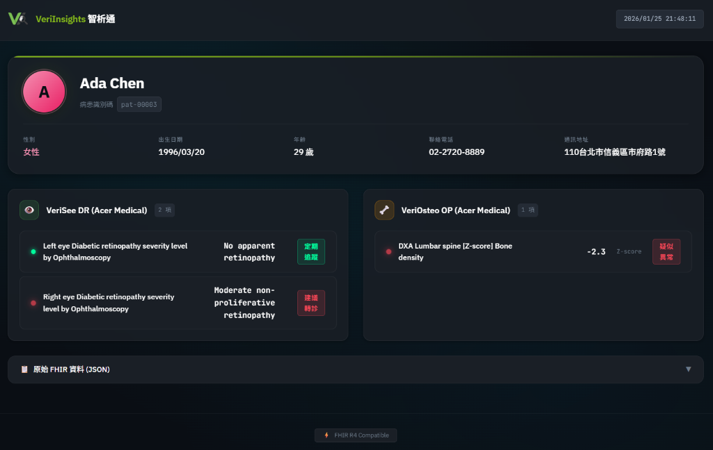
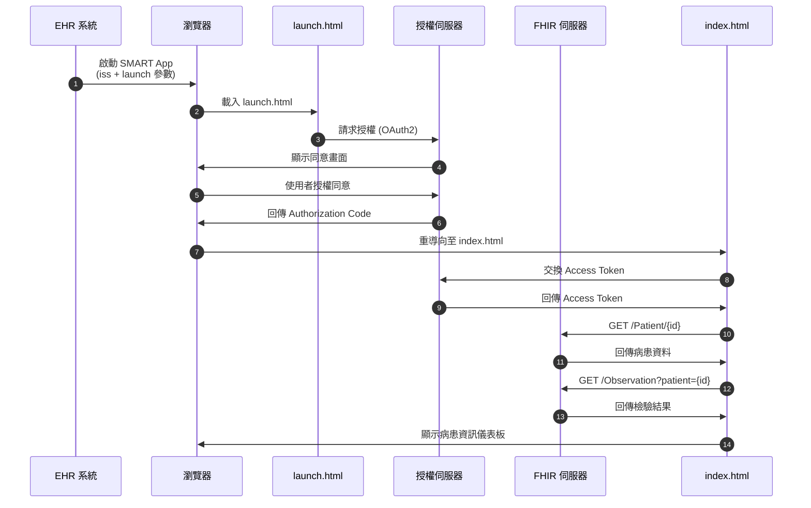

# VeriInsights 智析通 | SMART on FHIR Application

[](https://hl7.org/fhir/R4/)
[](https://docs.smarthealthit.org/)
[](https://opensource.org/licenses/MIT)

> **專為眼科與骨質疏鬆篩檢設計的醫療資訊整合平台。**
> VeriInsights 透過 SMART on FHIR 標準與醫院 EHR 系統整合，提供即時的 AI 判讀結果與風險評估，輔助醫師進行精準的轉診決策。

---

## 🎯 產品特色 (Product Features)

### 👁️ VeriSee DR (糖尿病視網膜病變篩檢)
- **自動化判讀**：接收 AI 篩檢結果，自動對應 LOINC 代碼。
- **智慧分級**：支援 No Apparent Retinopathy 到 Proliferative Retinopathy 的五級分類。
- **轉診建議**：
    - 🟢 **定期追蹤**：無明顯或輕微病變。
    - 🔴 **建議轉診**：中度以上非增殖性或增殖性視網膜病變。

### 🦴 VeriOsteo OP (骨質疏鬆風險評估)
- **年齡智慧切換**：
    - **≥ 50 歲**：顯示 **T-Score** (標準檢測指標)。
    - **20 - 49 歲**：顯示 **Z-Score** (同齡比較指標)。
- **風險警示**：當 T-Score ≤ -2.5 或 Z-Score ≤ -2.0 時，自動標示為「疑似異常」。

### 💻 現代化醫療介面
- **深色模式 (Dark Mode)**：降低診間螢幕眩光，適合長時間閱讀。
- **視覺化儀表板**：關鍵數值以紅綠燈號標示，異常狀況一目瞭然。
- **RWD 響應式設計**：支援桌機、平板等多種裝置操作。

---

## 📸 介面預覽 (Screenshots)



---

## 🏗️ 技術架構 (Technical Architecture)

本專案採用 **Vanilla JavaScript (ES6+)** 進行開發，不依賴大型前端框架，確保輕量化與高相容性。代碼經過模組化重構，易於維護與擴充。

### 🧩 模組化設計 (Modular Design)

| 檔案 | 職責說明 |
|------|----------|
| `js/config.js` | **設定中心**：定義所有 LOINC 代碼、臨床閾值 (Thresholds) 與多語系對照表。 |
| `js/observations.js` | **核心邏輯**：處理 Observation 資料分類 (VeriSee/VeriOsteo)、過濾與渲染邏輯。 |
| `js/patient.js` | **病患模組**：處理病患基本資料 (Patient Resource) 的呈現。 |
| `js/utils.js` | **工具函式庫**：提供 XSS 防護 (`escapeHtml`)、日期格式化、年齡計算等共用函數。 |
| `js/app.js` | **主程式**：負責 FHIR Client 初始化、OAuth2 流程控制與資料流協調。 |
| `index.html` | **視圖層**：依賴順序載入模組，提供語意化 HTML 結構與無障礙支援。 |

### 🔒 安全性與合規 (Security & Compliance)
- **FHIR R4 合規**：使用標準 `Patient` 與 `Observation` 資源。
- **XSS 防護**：所有動態渲染內容強制經過 HTML Entity Escape。
- **資料最小化**：僅請求必要的 `patient/*.read` 權限Scopes。
- **Session 管理**：每次啟動自動清除舊 Session，防止資料殘留。

### 📊 授權流程圖 (Authorization Flow)



---

## 🚀 快速開始 (Quick Start)

### 1. 安裝依賴
本專案為靜態網頁應用，無需編譯。您可以使用任何靜態伺服器運行：

```bash
# 使用 Python
python -m http.server 8080

# 或使用 Node.js npx
npx serve -l 8080
```

### 2. SMART Launcher 測試
前往 [SMART App Launcher](https://launch.smarthealthit.org/) 進行模擬測試：

1.  **Launch Type**: Provider EHR Launch
2.  **Launch URL**: `http://localhost:8080/launch.html`
3.  **FHIR Version**: R4
4.  **Patient**: 選擇任一測試病患 (建議選擇有 Observation 資料的病患)

### 3. Client ID 設定
若部署至正式環境，請在 `launch.html` 中更新 Client ID：

```javascript
FHIR.oauth2.authorize({
    "clientId": "YOUR_PRODUCTION_CLIENT_ID",
    "scope": "launch patient/*.read openid fhirUser",
    "redirectUri": "index.html"
});
```

---

## 📄 授權 (License)

MIT License © 2026 VeriInsights
