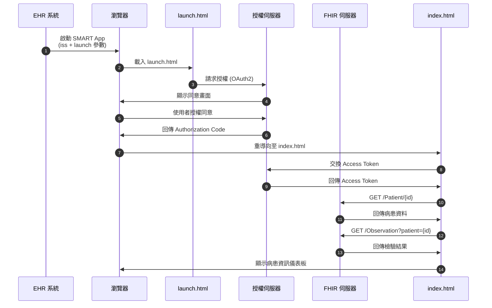

# SMART on FHIR 病患資訊系統

[](https://hl7.org/fhir/R4/)
[](https://docs.smarthealthit.org/)

SMART on FHIR 應用程式，用於顯示病患基本資料與檢驗結果。採用專業醫療介面設計，支援生命徵象與實驗室檢驗分類顯示。

## 📋 功能特色

- 🏥 **病患基本資料** - 姓名、性別、年齡、聯絡資訊
- ❤️ **生命徵象** - 心跳、血壓、體溫、血氧飽和度
- 🔬 **實驗室檢驗** - 血糖、血紅素、白血球、肌酐酸
- 📊 **狀態指示** - 正常/偏離/異常 視覺化警示
- 🌙 **深色主題** - 專業醫療儀表板設計

## 📁 專案結構

```
01171100_Smart App/
├── launch.html      # OAuth2 授權啟動頁
├── index.html       # 主應用程式（病患資訊顯示）
└── README.md        # 專案說明文件
```

## 🔧 技術規格

| 項目 | 規格 |
|------|------|
| FHIR 版本 | R4 |
| 授權協議 | OAuth2 (SMART on FHIR) |
| 前端框架 | Vanilla JavaScript |
| FHIR Client | [fhirclient.js](https://github.com/smart-on-fhir/client-js) |

## 🚀 使用方式

### 1. EHR 整合啟動

應用程式需從 EHR 系統透過 SMART Launch 啟動：

```
https://your-app-url/launch.html?iss=FHIR_SERVER_URL&launch=LAUNCH_TOKEN
```

### 2. 本地測試（使用 SMART Launcher）

1. 前往 [SMART App Launcher](https://launch.smarthealthit.org/)
2. 選擇 **Provider EHR Launch**
3. 設定 Launch URL: `http://localhost:8080/launch.html`
4. 選擇測試病患並啟動

### 3. 設定 Client ID

編輯 `launch.html` 修改 OAuth2 設定：

```javascript
FHIR.oauth2.authorize({
    "clientId": "your_client_id",
    "scope": "launch patient/*.read openid fhirUser",
    "redirectUri": "index.html"
});
```

## 📊 授權流程圖



## 🔒 安全性

- ✅ XSS 防護 - 所有動態內容已做 HTML Escape
- ✅ OAuth2 認證 - 符合 SMART on FHIR 規範
- ✅ HTTPS - 生產環境強制加密傳輸

## 📖 FHIR 資源

本應用程式使用以下 FHIR 資源：

| 資源類型 | 用途 |
|----------|------|
| `Patient` | 病患基本資料 |
| `Observation` | 檢驗結果與生命徵象 |

## 🛠️ 開發指南

### 本地開發伺服器

```bash
# 使用 Python
python -m http.server 8080

# 使用 Node.js
npx serve -l 8080

# 使用 PHP
php -S localhost:8080
```

### 程式碼審查

本專案包含 `code-review` skill，執行審查時會檢查：
- 安全性漏洞 (XSS, Injection)
- FHIR/HL7 合規性
- 程式碼品質與效能

## 📄 授權

MIT License

---

> 🏥 SMART on FHIR Application | FHIR R4 Compatible
